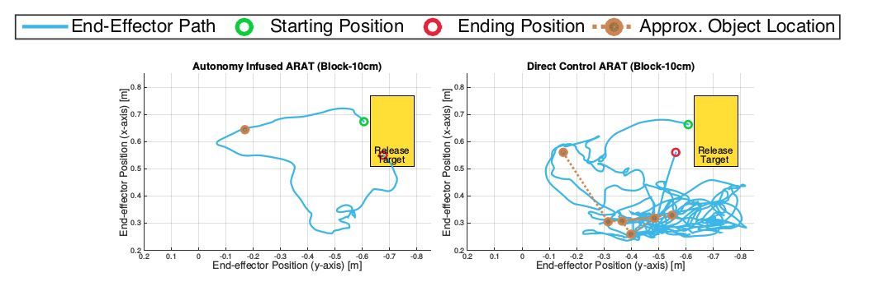

Author:
Date: 2017-07-10
Title: The Promise of Shared Autonomy in BCIs
Tags:
Status: published
Summary: For a person in 2017 with muscular dystrophy, cerebral palsy, or another disability that impairs mobility, the opportunities to live a normal, functioning life are greater than any other point in history. Just check out how cool this robotic arm is...

For a person in 2017 with muscular dystrophy, cerebral palsy, or another disability that impairs mobility, the opportunities to live a normal, functioning life are greater than any other point in history. Just check out how cool this robotic arm is...

<iframe width="560" height="315" align="middle" src="https://www.youtube.com/embed/iZYxJFROew8?ecver=1" frameborder="0" allowfullscreen></iframe>

With the current level of sophistication in artificial limbs, the field is now running up against an interesting problem: how should they be controlled? Using a standard joystick controller efficiently requires a significant amount of training, effort, and concentration. Furthermore, many of the patients who would benefit from an artificial limbs also have upper body mobility issues that make operating a standard joystick controller difficult. Thus, robotics researchers are now exploring a concept known as shared autonomy, which shares control over a prosthetic limb between the patient and an artificially intelligent system.

Robotics engineers are now exploring a concept known as shared autonomy to assist patients in controlling artificial limbs while still retaining the sense of direct control. In the robotics systems pioneered by robotics researcher [Sidd Srinivasa](https://homes.cs.washington.edu/~siddh/), direct control over a robotic limb is shared by the user and an intelligent system that calculates appropriate movements based on its estimate of the user’s intent. When attempting to perform an action, the user’s input is passed through a machine learning algorithm that calculates the probability that the user is attempting to perform each of a number of possible actions. When a threshold of certainty is reached for a particular action, the system then calculates the necessary movements required to complete that action. The key innovation to this shared autonomous system, however, is that this set of instructions is then blended with raw input from the user. For a full description of how this system works, see the paper [Shared Autonomy via Hindsight Optimization](https://arxiv.org/abs/1503.07619).

Shared autonomy improves upon previous techniques for robotic control in two major ways. First, the assistance provided by the intelligent system results in much more efficient completion of motor tasks, and less training time required to learn how to use the arm. Second, the inclusion of some degree of direct control over the arm preserves the responsiveness necessary for the limb to feel like an extension of the user’s body. Interestingly, participants who were able to determine the amount that control over the arm was shared often ended up selecting less assistance than was optimal. Evidently, users are willing to sacrifice some performance for the feeling of more direct control.

Shared autonomy was developed to allow users to perform complex actions with noisy and limited inputs and thus has application to many other fields of technology, including brain-computer interfaces (BCIs). There’s a lot of potential in BCI: giving paralyzed people a way to communicate and creating new ways to interact with computers and each other. However, the technical challenges involved in getting clean data from the brain are enormous. The brain is hard to access and the signals that we can detect are never easy to understand because the brain is a noisy, non-deterministic organ.

Existing forms of active BCIs, in which users execute commands through conscious, direct control, almost always rely on extensive training and usage protocols that involve averaging over multiple trial periods. Brain-computer interfaces that allow people to type or control a keyboard with their minds exist, but it’s hard to imagine these technologies being used in the real world in their current state.

Fortunately, there has already been some work applying the principles of shared autonomy to BCI. In one paper, Patients with cortical implants were instructed to remotely operate a robotic arm to move blocks placed at random areas in a field to a target region. Patients assisted by the shared autonomous system experienced much higher rates of success and also rated the task as being less difficult to complete.

<figure>

<figcaption>Comparison of arm trajectories between task with shared autonomy (autonomy infused) and direct control. (from [Muelling et al., 2015](https://arxiv.org/abs/1503.05451))</figcaption>
</figure>
 
The benefits of shared autonomy in these research applications should be seen as indicator of where things are heading in the broader fields of BCIs, neurotech, and UX in general. I am personally very excited about the possibility of shared autonomy and other forms of machine learning to allow us to circumvent some of the limitations of BCI and produce systems that work and feel good to use.

Even outside of robotics or BCI, the central concept of shared autonomy, that assisted, artifically intelligent technology works best when it *shares* control with the user is something to keep in mind. Having computers able to predict our intent and help us perform better is great, but only so far as it allows us to retain a sense of being in control.
